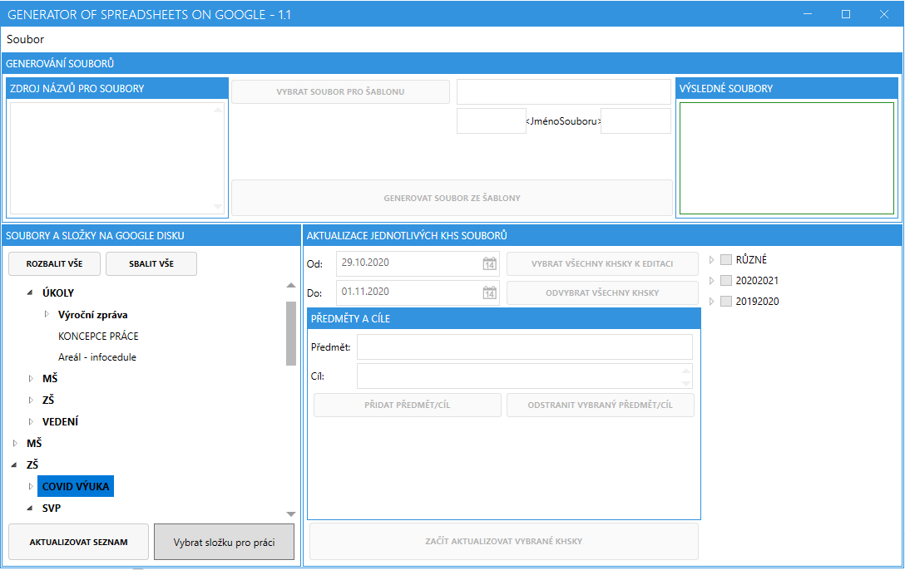
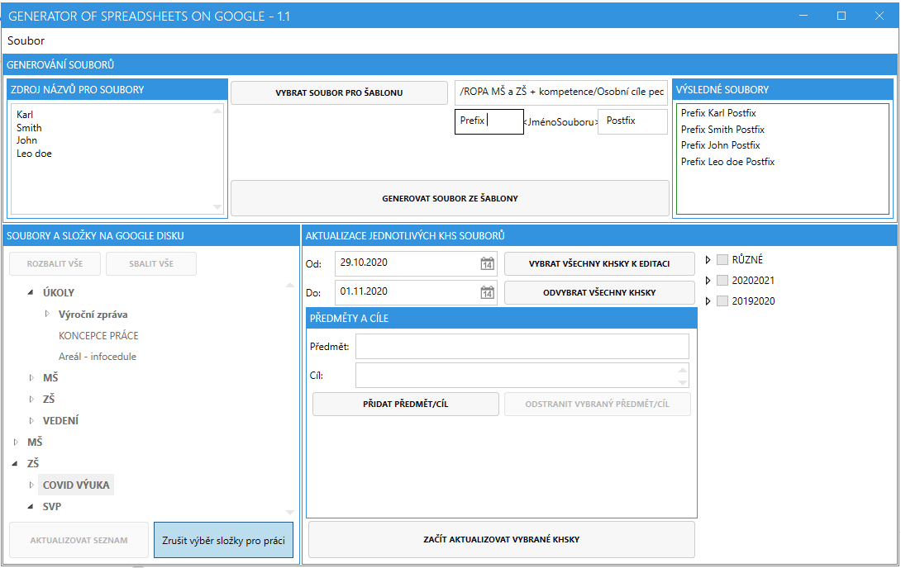
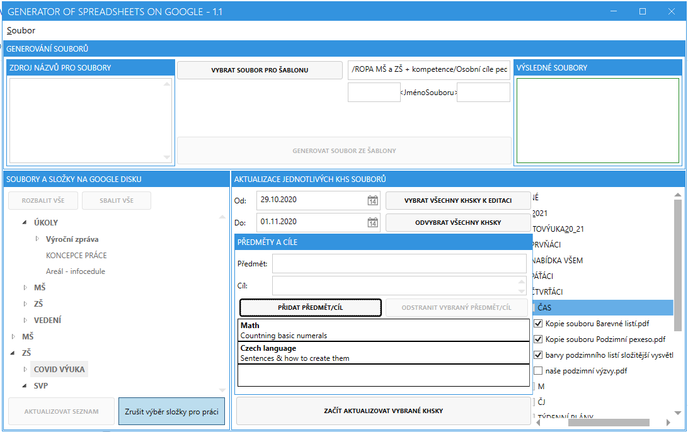

# GoogleSchoolProjectManager

This project was created for purpose of primary school (in czech rep.) to allow school to simply copy files (templates) located at Google Drive + multi-file edit Google Sheets to invoke same changes over several documents. Automation of labour.

----

## Features supported

- Multi-language
- Downloading list of files/folders from drive
- Copying file into several files with different names & same content
- Updating existing Google Sheets document with data/format
- Metro style

### Useful links

- [Google's API - Spreadsheet reference](https://developers.google.com/sheets/api/reference/rest/v4/spreadsheets/batchUpdate)
- [Google's API - Requests](https://developers.google.com/sheets/api/reference/rest/v4/spreadsheets/request)

----

## Build

1. Create/use Google APIs' account and add OAuth 2.0 authentication. Get `credentials.json` from it and save it to `GoogleSchoolProjectManager\GoogleSchoolProjectManager.Lib\` folder.
2. Build it via Visual Studio 2019 (or other applicable version)

----

## Usage Limits

There are existing limits to use Google's API if you are using free account. As of now (11th Jun 2021):

- 500 requests per 100 seconds per project
- 100 requests per 100 seconds per user

For more details please visit [Google's official webpage](https://developers.google.com/sheets/api/limits) with up-to-date values.

----

## App screenshots

Overview once list of folders/files received

Prepared for copying a template into multiple files

Prepared for updating existing Google Sheets

----

## License

Copyright © Jan Urbanec and contributors.

GoogleSchoolProjectManager is provided as-is under the MIT license. For more information see LICENSE.

----

## Libs used

- Google APIs Nugets (Drive, [Sheets](https://www.nuget.org/packages/Google.Apis.Sheets.v4/), Docs)
- Newtonsoft.JSON
- Ninject
- MahApps.Metro
- ControlzEx
- Microsoft.Xaml.Behaviors.Wpf
